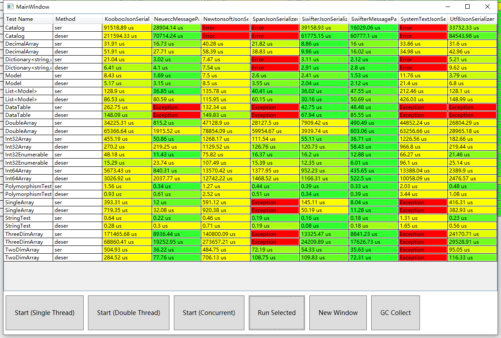

# Swifter.Json
#### A powerful, easy-to-use and fastest json serializer and deserializer on .Net platforms.

### Easy to use 简单实用
```C#
public class Demo
{
    public int Id { get; set; }
    public int Name { get; set; }
    public static void Main()
    {
        var json = JsonFormatter.SerializeObject(new { Id = 123, Name = "Dogwei" });
        var dic = JsonFormatter.DeserializeObject<Dictionary<string, object>>(json);
        var obj = JsonFormatter.DeserializeObject<Demo>(json);
    }
}
```


## Supported data structures and types 支持的数据类型和结构
```C#
bool, byte, sbyte, short, ushort, char, int, uint, long, ulong, IntPtr, UIntPtr,
float, double, decimal, string, enum, DateTime, DateTimeOffset, TimeSpan, Guid,
BigInteger, Complex, DBNull, Nullable<T>, Tuple<...>, ValueTuple<...>, Version,
Uri, Assembly, Type, MemberInfo, MethodInfo, FieldInfo, PropertyInfo, ConstructorInfo,
EventInfo, Array, Multidimensional-Arrays, IList, IList<T>, ICollection, ICollection<T>,
IDictionary, IDictionary<TKey, TValue>, IEnumerable, IEnumerable<T>, DataSet, DataTable,
DataRow, DbRowObject, DbDataReader...

Other types are treated as object 其他类型当作对象处理
```

## Supported platforms and runtimes 支持的平台和运行时
```
.NET Framework 2.0+, .NET Core 2.0+, .NET Standard 2.0+, MONO, MONO AOT, MONO FULL-AOT,
Unity, Xamarin.iOS, Xamarin.Android

Uncertain：Unity IL2CPP

Unsupported:
```
##### Note: .NET Core uses the Core version, and other platforms use the Framework version or Standard version.
##### Because the Core version is performance-optimized. the Framework version and Standard version are optimized for compatibility.
##### Framework version and Standard version can run directly on AOT platforms.
##### 注意：.NET Core 请使用 Core 版本，其他平台和运行时请使用 Framework 版本或 Standard 版本。
##### 因为 Core 版本专为性能优化，Framework 版本和 Standard 版本为兼容性优化。
##### Framework 版本和 Standard 版本可以直接在 AOT 平台上运行。

## Supported features 支持的功能
```
LoopReferencingNull:
    Objects that appear a loop reference during serialization are treated as Null.
    在序列化时出现循环引用的对象将用 Null 表示。
    
MultiReferencingReference:
    Allow use { "$ref": "#/obj/1/target" } to represent objects that are repeatedly referenced.
    允许使用 { "$ref": "#/obj/1/target" } 写法表示重复引用的对象。
    
AsOrderedObjectDeserialize
    Perform as-ordered object fields parsing, which can improve parsing performance of ordered Json objects.
    执行假定有序的对象字段解析，这可以提高有序 Json 对象的解析性能。
    
DeflateDeserialize
    Perform deflate(no spaces) Json parsing, which can improve parsing performance.
    执行紧凑（无空白字符）的 Json 解析，这可以提高解析性能。
    
Indented
    Json indents and wraps during serialization, which makes Json beautiful.
    序列化时对 Json 进行缩进和换行，让 Json 变得好看。
    
CamelCaseWhenSerialize
    Convert name to camel case when serializing objects. ::: new { Name = "Dogwei" } -> { "name": "Dogwei" }
    序列化对象时，将对象的名称转换为骆驼命名法。 
    
IgnoreNull | IgnoreZero | IgnoreEmptyString
    Null, 0, "" values are ignored during serialization. 
    序列化时分别跳过 Null, 0 和 "" 值。 ::: { A = (string)null, B = 0, C = "", D = 1 } -> { "D": 1 }
    
For more features, please see Swifter.Json.JsonFormatterOptions enum.
更多功能请看 Swifter.Json.JsonFormatterOptions 配置项。
```
## Performance 性能

###### ServiceStack.Json, Jil, LitJson, NetJson and etc libraries are not shown because there are too many errors; if necessary, you can clone the test program on GitHub and run. Most of the Json serialization libraries of .NET have been included.
